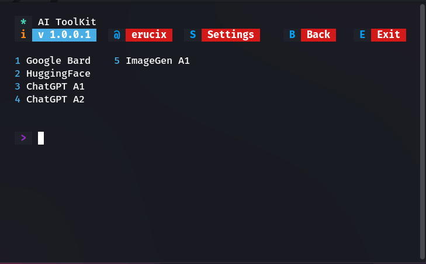

# AI-Kit
<center>

</center>

#### Script Requirements:
- NodeJS (must)

# How to use?
Paste this to your terminal:
```bash
git clone https://github.com/erucix/AI-Kit.git
cd AI-Kit
npm i form-data
node ai-kit.js

```

I have managed to reverse engineer bunch of android application using `Burpsuite`+`Frida` and this is the collection of all available API till now. These features can break anytime soon since the decryption keys of server response are change frequently by server. I am still not able to decrypt `DES` encryption for ``ChatGPT A2``, so this returns the encrypted server response. I will fix this once I learn `crypto` library. Also I will be adding more APIs. Thanks.

### Desclaimer:
I hold no respoonsibility for any illegal activity and misuse of this program.